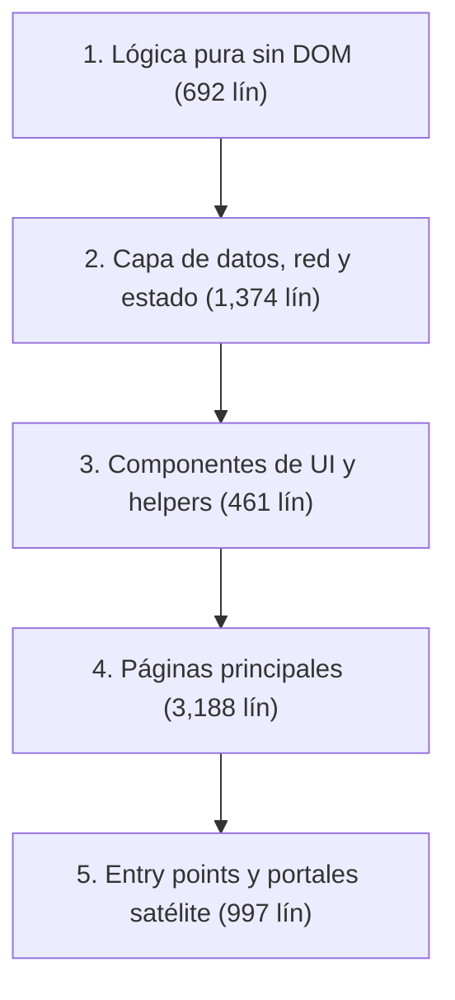
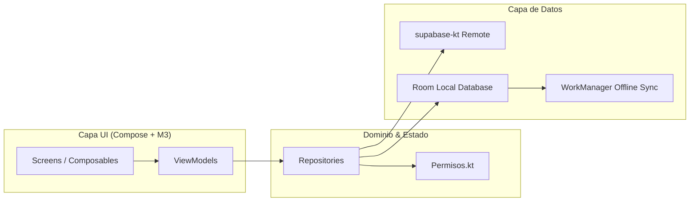
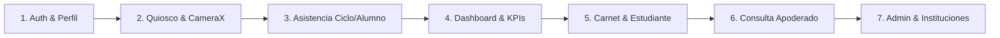

# Plan de Migración: TypeScript (Frontend Web) y Android Nativo (Kotlin + Jetpack Compose)

Documento técnico y operativo para la modernización gradual del frontend web y la construcción de la aplicación móvil nativa Android, manteniendo la compatibilidad total con la base de datos Supabase existente (Auth, RLS, RPC, Storage) y preservando el funcionamiento ininterrumpido de la PWA web y el ejecutable de escritorio (.exe Electron).

> [!NOTE]
> **Estado de la migración (v4.0.0):**
> - **Android Nativo:** **Completado al 100% (Release Principal v4.0.0)**.
>   - Portadas y probadas en dispositivo real las 33 pantallas del sistema en Kotlin + Jetpack Compose + Material 3.
>   - Escaneo QR acelerado con CameraX y Google ML Kit, quiosco seguro con bloqueo por PIN, y persistencia offline garantizada mediante base de datos local Room y cola en segundo plano con WorkManager.
>   - Compilación para Android 17 (compileSdk 37, minSdk 24) y pipeline CI/CD en `.github/workflows/android-nativo.yml` con publicación directa a GitHub Releases (`app-latest` / `registro-academico.apk`).
>   - La app anterior basada en WebView (`android/`) pasa a estado «Lite» y convive instalada sin interferir.
> - **TypeScript (Frontend Web):** **En curso (adopción gradual)**.
>   - Modelos base tipados en `types/` y verificación de tipos estática obligatoria (`npm run typecheck` con `tsc --noEmit`) activa en el pipeline de CI (`.github/workflows/ci.yml`).
>   - Corrección en la matriz tipada de asistencias para contabilizar la tardanza como presente.

---

## A. Estado actual y justificación técnica

### 1. Arquitectura actual del sistema

| Componente | Tecnología | Ubicación | Modo de ejecución y empaquetado |
|---|---|---|---|
| **Frontend Web / PWA** | Vanilla JavaScript (ES modules nativos, sin bundler ni compilación), CSS3 (tokens semánticos en `diseno.css`), Service Worker (`sw.js`). | Raíz, `assets/js/`, `assets/css/` | Servido directamente como archivos estáticos (Nginx / GitHub Pages). Abre sin internet mediante caché `ra-shell-v1`. |
| **App Android (actual)** | WebView en contenedor Java/Android (`compileSdk 34`, `minSdk 24`, Gradle 8.9). | `android/` | Carga la URL remota de la PWA (`docente` y `estudiante`). Depende del motor WebView del sistema operativo. |
| **Programa de PC** | Electron 33. | `desktop/` | Empaqueta la web localmente. Descarga CDNs a `desktop/app/vendor` con `scripts/preparar.mjs` para correr 100% offline. |
| **Backend y Persistencia** | Supabase (PostgreSQL 15+, PostgREST, GoTrue Auth, Storage, Realtime). | `supabase/` | Multi-institución aislado por RLS (`mi_colegio()`), funciones RPC (`sa_*`, `registrar_salidas`, `consulta_apoderado`). |

### 2. Por qué migrar

1. **Frontend Web (~6,712 líneas de JS sin tipado):**
   - El crecimiento del sistema a 33 páginas y múltiples subsistemas (quiosco, carnet dinámico, periodos, auditoría, multi-instituto) genera fragilidad ante refactorizaciones.
   - Las discrepancias entre los modelos de la base de datos y los objetos en memoria solo se detectan en tiempo de ejecución.
   - La migración a **TypeScript gradual** aporta contratos estrictos, autocompletado fiable y validación de tipos estática en CI (`tsc --noEmit`), sin obligar a rehacer la interfaz ni romper los módulos ES.

2. **App Móvil (de WebView a Kotlin + Jetpack Compose):**
   - **Rendimiento y estabilidad en quiosco:** El WebView sufre degradación térmica y fugas de memoria con el uso continuo de la cámara WebRTC (`getUserMedia`), afectando la detección QR en teléfonos de gama de entrada.
   - **Acceso a hardware:** Android nativo permite usar **CameraX + Google ML Kit** a 60 fps constantes, sensor NFC nativo sin intermediarios de navegador, y gestión estricta del ciclo de vida (`WakeLock` seguro para la puerta).
   - **Persistencia y sincronización en segundo plano:** El Service Worker en Android es suspendido agresivamente por el sistema operativo. Con **WorkManager + Room**, la cola offline sincroniza de forma garantizada incluso con la app cerrada o tras reiniciar el dispositivo.

---

## B. Fase TypeScript (Frontend Web)

### 1. Orden de migración por módulo y tamaño real del código

La migración se realiza de las hojas a la raíz del árbol de dependencias: primero módulos sin dependencias de DOM ni red, luego la capa de datos, luego la UI compartida, y finalmente las páginas individuales.



#### Bloque 1: Lógica pura y reglas de negocio (692 líneas)
*Sin dependencias del DOM ni de Supabase. Cobertura directa con tests unitarios existentes.*

| Archivo | Líneas | Responsabilidad |
|---|---:|---|
| `assets/js/utils.js` | 226 | Fechas en zona Lima, formateo, escape HTML, cadenas y CSV. |
| `assets/js/stats.js` | 168 | Cálculo de asistencias, tardanzas, porcentajes y parsing CSV. |
| `assets/js/calendario.js` | 82 | Horarios por carrera, cálculo de puntualidad y tolerancia. |
| `assets/js/cola.js` | 62 | Almacenamiento y recuperación de cola offline en `localStorage`. |
| `assets/js/fusion.js` | 44 | Plan de migración de datos locales a la base online. |
| `assets/js/permisos.js` | 40 | Matriz de autorización por rol (`puede(accion)`). |
| `assets/js/promocion.js` | 36 | Promoción de ciclos y egreso de alumnos del VI ciclo. |
| `assets/js/riesgo.js` | 34 | Algoritmo de detección temprana de inasistencia crítica. |

#### Bloque 2: Capa de datos, red, estado y sincronización (1,374 líneas)
*Definición de clientes Supabase, manejo de tokens y cola de reintentos.*

| Archivo | Líneas | Responsabilidad |
|---|---:|---|
| `assets/js/api-extra.js` | 472 | Operaciones extendidas: justificaciones, cursos, auditoría, multi-instituto. |
| `assets/js/api.js` | 302 | Adaptador de base de datos Supabase y modo local/demo. |
| `assets/js/respaldo-offline.js` | 126 | Exportación e importación de archivos `.rabackup`. |
| `assets/js/sync.js` | 93 | Orquestador de sincronización y eventos de red. |
| `assets/js/demo-data.js` | 87 | Generador determinista de datos de prueba para modo demo. |
| `assets/js/state.js` | 83 | Estado global reactivo en memoria (`DB`). |
| `assets/js/config.js` | 74 | Variables de configuración, claves públicas y endpoints. |
| `assets/js/errlog.js` | 48 | Captura y reporte de excepciones cliente a Supabase. |
| `assets/js/qr-seguro.js` | 41 | Generación y validación HMAC-SHA256 de códigos QR temporales. |
| `assets/js/compat.js` | 39 | Verificaciones de capacidades del navegador. |
| `assets/js/theme-init.js` | 9 | Inicialización bloqueante del tema claro/oscuro. |

#### Bloque 3: Componentes de UI y utilidades visuales (461 líneas)

| Archivo | Líneas | Responsabilidad |
|---|---:|---|
| `assets/js/ui.js` | 215 | `formModal`, `confirmDialog`, `toast`, `pageHead`, `icon`, `skeleton`. |
| `assets/js/notificaciones.js` | 70 | Polling en segundo plano de comunicados institucionales. |
| `assets/js/modo.js` | 66 | Selector de modo online/local para la versión de PC. |
| `assets/js/alerta.js` | 59 | Alerta flotante de asistencia con foto censurada. |
| `assets/js/marca.js` | 51 | Renderizado dinámico de nombres e identidades institucionales. |

#### Bloque 4: Páginas del panel principal (3,188 líneas)

| Archivo | Líneas | Archivo | Líneas |
|---|---:|---|---:|
| `assets/js/pages/registro.js` | 394 | `assets/js/pages/periodos.js` | 107 |
| `assets/js/pages/mantenimiento.js` | 393 | `assets/js/pages/perfil.js` | 95 |
| `assets/js/pages/instituciones.js` | 362 | `assets/js/pages/avisos.js` | 90 |
| `assets/js/pages/quiosco.js` | 352 | `assets/js/pages/instituto.js` | 87 |
| `assets/js/pages/dashboard.js` | 256 | `assets/js/pages/solicitudes.js` | 62 |
| `assets/js/pages/sistema.js` | 182 | `assets/js/pages/migrar.js` | 61 |
| `assets/js/pages/reportes.js` | 176 | `assets/js/pages/alertas.js` | 52 |
| `assets/js/pages/offline.js` | 158 | `assets/js/pages/historial.js` | 45 |
| `assets/js/pages/cursos.js` | 147 | `assets/js/pages/consultas.js` | 120 |
| `assets/js/pages/calendario.js` | 118 | `assets/js/pages/carnet.js` | 114 |
| `assets/js/pages/personal.js` | 109 | `assets/js/pages/codigo.js` | 108 |

#### Bloque 5: Puntos de entrada y portales satélite (997 líneas)

| Archivo | Líneas | Responsabilidad |
|---|---:|---|
| `assets/js/estudiante/main.js` | 419 | Interfaz y flujo completo de Mi Carnet Institucional. |
| `assets/js/main.js` | 282 | Router por hash, autenticación y ciclo de vida de la PWA. |
| `assets/js/estudiante/api.js` | 209 | Capa de datos del portal de estudiantes. |
| `assets/js/apoderado/main.js` | 87 | Consulta de asistencia por código de 12 caracteres. |

*Total frontend web analizado: **6,712 líneas de código**.*

---

### 2. Estrategia técnica de compilación e integración

Para no romper los navegadores que cargan ES modules nativos ni el pipeline existente, se adopta compilación **módulo a módulo sin bundling**:

1. **Configuración de TypeScript (`tsconfig.json` base):**
   ```json
   {
     "compilerOptions": {
       "target": "ES2022",
       "module": "NodeNext",
       "moduleResolution": "NodeNext",
       "lib": ["ES2022", "DOM", "DOM.Iterable"],
       "allowJs": true,
       "checkJs": true,
       "strict": true,
       "noImplicitAny": true,
       "noEmit": true,
       "skipLibCheck": true,
       "isolatedModules": true
     },
     "include": ["assets/js/**/*", "tests/**/*"]
   }
   ```
2. **Estrategia sin bundle:**
   - Durante la transición, se usa `checkJs: true` y directivas `// @ts-check` junto con archivos de definición de tipos (`types/models.d.ts`).
   - Al convertir un archivo a `.ts`, se compila con `tsc` hacia un directorio espejo o se mantiene resolución de extensiones `.js` estándar de TypeScript (TypeScript permite escribir `import { esc } from './utils.js'` donde el archivo fuente es `utils.ts`).
3. **Ajustes en el ecosistema:**
   - **`scripts/check.py`:** Modificar `check_js_imports()` para resolver tanto `.js` como `.ts`.
   - **`sw.js` (Service Worker):** Mantener las rutas de precarga en la lista `SHELL` apuntando a los archivos servidos finales. Incrementar `CACHE = "ra-shell-v2"` al cambiar artefactos.
   - **Dockerfile:** Agregar paso de verificación (`RUN npm run typecheck`) previo al empaquetado de Nginx.
   - **`desktop/scripts/preparar.mjs`:** Ejecutar verificación previa a la copia hacia `desktop/app`.

---

### 3. Modelos y tipos compartidos derivados de SQL (`types/models.ts`)

```typescript
export type RolUsuario = 'Administrador' | 'Docente' | 'Coordinador' | 'Auxiliar';
export type EstadoAlumno = 'ACTIVO' | 'INACTIVO';
export type EstadoAsistencia = 'P' | 'T' | 'J' | 'F';

export interface Colegio {
  id: string;
  nombre: string;
  codigo_registro: string;
  activo?: boolean;
  created_at: string;
}

export interface Perfil {
  id: string;
  colegio_id: string;
  rol: RolUsuario;
  carrera?: string | null;
  nombre: string | null;
  foto_path?: string | null;
}

export interface Alumno {
  id: string;
  colegio_id: string;
  codigo: string;
  nombre: string;
  nivel: string;
  grado: string;
  apoderado: string;
  apoderado_telefono?: string | null;
  apoderado_email?: string | null;
  codigo_apoderado?: string;
  estado: EstadoAlumno;
  aprobado: boolean;
  user_id?: string | null;
  foto_path?: string | null;
}

export interface Asistencia {
  id: string;
  colegio_id: string;
  alumno_id: string;
  fecha: string;        // YYYY-MM-DD
  hora: string;         // HH:MM:SS
  hora_salida?: string | null;
  registrado_por?: string | null;
}

export interface Justificacion {
  id: string;
  colegio_id: string;
  alumno_id: string;
  fecha: string;
  tipo: 'Falta justificada' | 'Permiso' | 'Tardanza justificada';
  motivo: string;
  registrado_por?: string | null;
}

export interface Periodo {
  id: string;
  colegio_id: string;
  nombre: string;
  inicio: string;
  activo: boolean;
  cerrado_en?: string | null;
}
```

---

## C. Fase Android Nativa (Kotlin + Jetpack Compose)

Se desarrollará en un directorio independiente `android-nativo/` para **no alterar ni degradar** el APK WebView existente en `android/`.



### 1. Stack tecnológico y arquitectura

- **Lenguaje:** Kotlin 2.0+ con Coroutines y StateFlow.
- **Interfaz:** Jetpack Compose con Material 3 y sistema de tokens de `diseno.css`.
- **Arquitectura:** Clean Architecture / MVVM con Google Hilt para inyección de dependencias.
- **Navegación:** Navigation Compose con rutas tipadas (`kotlinx.serialization`).
- **Backend SDK:** `supabase-kt` (módulos `gotrue-kt`, `postgrest-kt`, `storage-kt`, `realtime-kt`) consumiendo exactamente las mismas credenciales y políticas RLS.
- **Cámara y QR:** CameraX + Google ML Kit Barcode Scanning (detección local en milisegundos).
- **Seguridad local:** `EncryptedSharedPreferences` (Android Keystore) para sesión JWT y PIN del quiosco.
- **Persistencia offline:** Room Database para caché local y tabla de cola idéntica a `cola.js`.
- **Sincronización:** `WorkManager` con `CoroutineWorker` y restricción de conectividad (`NetworkType.CONNECTED`).

---

### 2. Prioridad de pantallas y paridad funcional



1. **Hito 1: Autenticación y Perfil (`AuthRepository`, `PerfilScreen`)**
   - Login con correo y contraseña vía Supabase Auth.
   - Carga y actualización de perfil institucional (`perfiles`).
   - Almacenamiento seguro del token de sesión.
2. **Hito 2: Modo Quiosco y Escáner QR (`QuioscoScreen`)**
   - Escaneo ultrarrápido con CameraX + ML Kit.
   - Validación de códigos QR estáticos y dinámicos (HMAC-SHA256).
   - Modo pantalla completa con bloqueo por PIN numérico hasheado.
   - Registro de ingreso y salida (`registrar_salidas`).
3. **Hito 3: Registro y Consulta de Asistencia (`AsistenciaScreen`)**
   - Selección por Carrera y Ciclo/Salón.
   - Registro manual y masivo de asistencias.
   - Historial por alumno con filtros de fecha.
4. **Hito 4: Dashboard y Métricas (`DashboardScreen`)**
   - Indicadores KPI (total matriculados, presentes, tardanzas, faltas).
   - Gráficos nativos (gráfico circular de asistencia y barras por ciclo) usando Canvas o biblioteca Vico.
5. **Hito 5: Mi Carnet Institucional (Flavor `estudiante`)**
   - Carnet virtual con código QR de alto contraste.
   - Subida de foto a bucket Supabase Storage (`fotos-alumnos`).
   - Consulta personal de asistencia y comunicados.
6. **Hito 6: Portal de Apoderado (`ApoderadoScreen`)**
   - Consulta pública solo con código de 12 caracteres vía función RPC `consulta_apoderado`.
7. **Hito 7: Administración y Multi-institución (`SuperAdminScreen`)**
   - Consumo de RPCs `sa_listar`, `sa_crear`, `sa_renombrar`, `sa_activar`.
   - Cambio dinámico de institución para superadministradores.

---

### 3. Paridad de permisos (`Permisos.kt`)

La lógica de `permisos.js` se replica en Kotlin para control de UI en Android (la base de datos mantiene el control real vía RLS):

```kotlin
enum class Rol { ADMIN, DOCENTE, COORDINADOR, AUXILIAR }

object Permisos {
    fun puede(accion: String, rol: Rol?, carreraUsuario: String? = null, carreraObjetivo: String? = null): Boolean {
        if (rol == null) return false
        if (rol == Rol.ADMIN) return true

        return when (accion) {
            "asis-registrar", "quiosco-marcar", "avisos-enviar" ->
                if (rol == Rol.COORDINADOR) carreraUsuario == carreraObjetivo else true
            "comunicados-publicar", "asistencia-ver" -> true
            "materias-gestionar", "periodos-cerrar", "alumnos-eliminar" -> false
            else -> false
        }
    }
}
```

---

### 4. Sistema de diseño y tokens en Jetpack Compose

Mapeo de las variables de `diseno.css` a la paleta de Compose:

```kotlin
// Theme.kt
val NavyDark = Color(0xFF17223B)
val AmberAccent = Color(0xFFF2AB35)
val TealSuccess = Color(0xFF08745D)
val RedDanger = Color(0xFFB02B27)
val PaperLight = Color(0xFFF2F4F9)
val PanelDark = Color(0xFF131B2D)
val PaperDark = Color(0xFF0A101E)

private val DarkColorScheme = darkColorScheme(
    primary = AmberAccent,
    background = PaperDark,
    surface = PanelDark,
    onPrimary = Color(0xFF291906),
    onBackground = Color(0xFFE9EDF4)
)

private val LightColorScheme = lightColorScheme(
    primary = NavyDark,
    secondary = AmberAccent,
    background = PaperLight,
    surface = Color.White,
    onPrimary = Color.White,
    onBackground = Color(0xFF17223B)
)
```

---

### 5. Flavors, firma y CI para Android Nativo

- **Flavors en `android-nativo/app/build.gradle.kts`:**
  - `docente`: Application ID `app.registroacademico.nativo`, nombre «Asistencia Institucional».
  - `estudiante`: Application ID `app.registroacademico.estudiante.nativo`, nombre «Mi Carnet».
- **Integración Continua (`.github/workflows/android-nativo.yml`):**
  - Pasos: Checkout → Setup Java 21 → `./gradlew ktlintCheck test assembleRelease`.
  - Firma mediante secretos de GitHub Actions (`KEYSTORE_BASE64`, `KEY_ALIAS`, `KEY_PASSWORD`).
  - Publicación automática de APKs en GitHub Releases.

---

## D. Plan por hitos y asignación de trabajo

| Hito | Alcance técnico | Criterio de aceptación medible | Estado | Agente AGY / Responsable |
|---|---|---|:---:|---|
| **H1: TS Core** | Modelos `types/` + lógica pura (Bloque 1) a TS. | `tsc --noEmit` en 0 errores; `npm test` verde. | **Completado** | Tipado de modelos y utilidades base |
| **H2: TS Red & UI** | Capa de datos (Bloque 2) y componentes UI (Bloque 3). | Cero errores de tipos en llamadas Supabase y modales. | **En curso** | Validación incremental en `tsconfig.json` |
| **H3: TS Pages & CI** | Conversión de páginas y pipeline en GitHub Actions. | Build en CI ejecutando `tsc` y tests sin fallos. | **En curso** | `npm run typecheck` activo en CI |
| **H4: Android Base** | Estructura Compose, Hilt, Supabase Auth y pantallas de Login/Perfil. | Login exitoso y navegación fluida. | **Completado** | Módulos Hilt, MVVM y navegación base |
| **H5: Quiosco Nativo** | CameraX, ML Kit, lógica de escaneo, sonido y bloqueo por PIN. | Escaneo QR en < 100 ms y salida segura con PIN. | **Completado** | Probado en hardware real por el usuario |
| **H6: Offline & Room** | Base de datos Room, cola de envíos y WorkManager en segundo plano. | Registros en modo avión sincronizan al reconectar. | **Completado** | Probado en hardware real por el usuario |
| **H7: Docente Release** | Flavor docente nativo (`pe.registroacademico.nativo.docente`), 33 pantallas y CI de release. | APK `registro-academico.apk` publicado en `app-latest` y tags. | **Completado** | Release Principal v4.0.0 (estudiante en Lite) |

---

## E. Requisitos del entorno de desarrollo

1. **Estado actual verificado en el equipo:**
   - **Node.js:** v24 LTS instalado.
   - **JDK:** Java 21 instalado y configurado en `JAVA_HOME`.
   - **Android SDK:** Ubicado en `~/android-build/sdk` (API 34, Build-Tools 34.0.0).
   - **Gradle:** v8.9 presente en `~/android-build`.
2. **Acciones inmediatas en la máquina local:**
   - **Limpieza:** Eliminar el directorio `~/dev/flutter` descargado por error para recuperar espacio en disco.
   - **Herramientas Android:** Android Studio es **opcional**. La compilación, ejecución de tests y generación de APKs puede realizarse al 100% mediante terminal con `./gradlew assembleRelease` y `adb`. Instalar Android Studio solo si se desean previsualizaciones interactivas de Compose (`@Preview`).

---

## F. Decisiones abiertas para el usuario

1. **Estructura de repositorio:**
   - *Opción A (Recomendada):* Monorepo con carpeta `android-nativo/` manteniendo la sincronización de modelos con la web en un solo commit.
   - *Opción B:* Repositorio independiente en GitHub exclusivamente para la app Android nativa.
2. **Canal de distribución de la app nativa:**
   - *Opción A (Recomendada inicial):* Descarga directa de APKs firmados desde las Releases de GitHub (sin costos).
   - *Opción B:* Publicación oficial en Google Play Store (requiere pago único de cuenta de desarrollador de $25 USD y revisión de políticas de privacidad).
3. **Mecanismo de notificaciones en el teléfono:**
   - *Opción A (Simple y sin dependencias):* Consulta periódica en segundo plano vía `WorkManager` (equivalente al sistema actual).
   - *Opción B (Tiempo real):* Integración de Firebase Cloud Messaging (FCM), requiriendo un proyecto activo en Google Firebase y configuración de credenciales.
4. **Evolución del pipeline web:**
   - Mantener TypeScript compilando archivos individuales para conservar ES modules nativos o adoptar un empaquetador moderno como **Vite** cuando concluya la migración.
